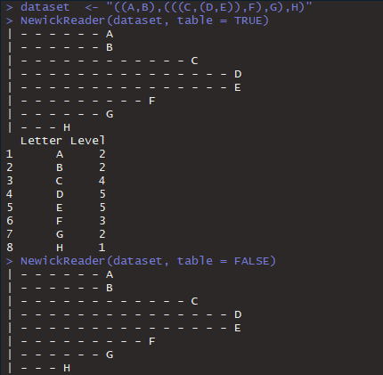

# The Newick-String-Reader

This is a Newick-String Reader for R without the lengths only the level of the letters will be shown. 

From [Wikipedia](https://en.wikipedia.org/wiki/Newick_format)

*In mathematics, Newick tree format (or Newick notation or New Hampshire tree format) is a way of representing graph-theoretical trees with edge lengths using parentheses and commas. It was adopted by James Archie, William H. E. Day, Joseph Felsenstein, Wayne Maddison, Christopher Meacham, F. James Rohlf, and David Swofford, at two meetings in 1986, the second of which was at Newick's restaurant in Dover, New Hampshire, US. The adopted format is a generalization of the format developed by Meacham in 1984 for the first tree-drawing programs in Felsenstein's PHYLIP package.*


## Installation

```bash
devtools::install_github("SandraKla/NewickReader")
```

## Example
```bash
 NewickReader("(A,B,(D,E,(F)),C)")
```



